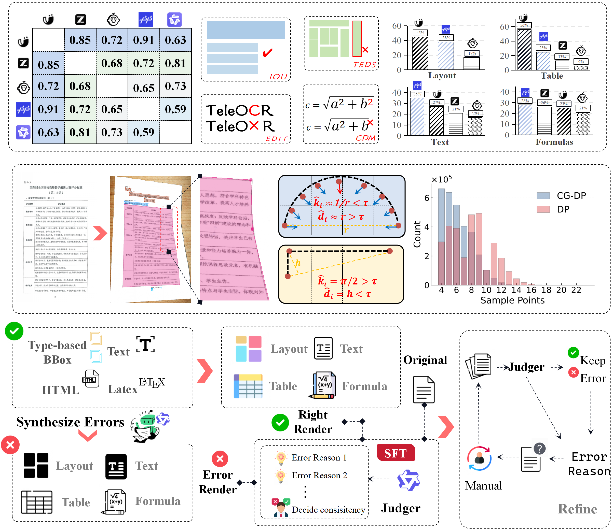
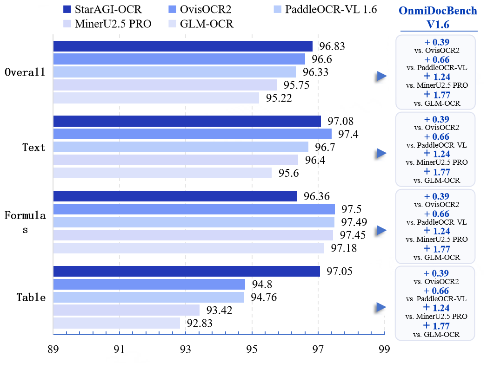

# StarAGI-OCR

<div align="center">

[](LICENSE)
[]()
[]()

**Unified Document Parsing for Digital and Camera-Captured Documents**

</div>

---

## 🔥 News

- **2026/08** Release of **StarAGI-OCR-1B**

---

## Introduction

StarAGI-OCR is a lightweight (≈1B parameters), commercial-grade, open-source Vision-Language Model designed specifically for document understanding.

Unlike existing methods that mainly target either digital documents or camera-captured documents, StarAGI-OCR unifies both scenarios within a single framework.

Compared with previous document parsing models, StarAGI-OCR introduces

- Multi-node Consensus Voting (MCV) for automatic pseudo-label generation
- Geometry-aware document modeling for camera-captured documents
- Curvature-Guided Douglas-Peucker Sampling (CGDP)
- Image-to-image self-verification for automatic data refinement
- Progressive four-stage training pipeline
- Content-Structure Decoupled Learning for tables and formulas

These techniques enable StarAGI-OCR to achieve state-of-the-art performance on both digital and camera-captured document benchmarks while remaining lightweight enough for practical deployment.

---

# Data Engine

<div align="center">



</div>

Our automatic data engine contains

- Multi-node Consensus Voting
- Geometry-aware Data Synthesis
- Image-to-Image Self Verification
- Progressive Data Cleaning

No human annotation is required for most generated data.

---

# Progressive Training

StarAGI-OCR is trained in four stages.

| Stage | Objective |
|---------|-----------------------------|
| Stage 1 | Vision-Language Alignment |
| Stage 2 | Geometry-aware Document Parsing |
| Stage 3 | Content-Structure Decoupled Learning |
| Stage 4 | Reinforcement Learning |


# Performance

## OmniDocBench v1.6

<div align="center">



</div>

## Wild OmniDocBench v1.5

| Model | Score |
|-------|------:|
| StarAGI-OCR | 89.09 |
| PaddleOCR-VL | XX.X |
| MinerU2.5 | XX.X |

## PureDocBench

| Model | Score |
|-------|------:|
| StarAGI-OCR | XX.X |
| PaddleOCR-VL | XX.X |
| MinerU2.5 | XX.X |

## ICDAR2026 Sci-ImageMiner

| Model | Score |
|-------|------:|
| StarAGI-OCR | XX.X |


<!-- --- -->
<!-- 
# Architecture

<div align="center">


</div>

StarAGI-OCR consists of

- Vision Encoder
- Aligner
- Qwen3 Language Model

and is trained using four progressive stages.

--- -->
---

# Installation

## Clone

```bash
git clone https://github.com/TeleOCR/StarAGI-OCR.git

cd StarAGI-OCR
```

Install

```bash
pip install -r requirements.txt
```

---

# Model Zoo

| Model | Size | Download |
|------|------|------|
| StarAGI-OCR-1B | 1.2B | Coming Soon |
| StarAGI-OCR-3B | 3B | Coming Soon |

---

# Quick Start

## Python

```python
from teleocr import TeleOCRVL

model = TeleOCRVL.from_pretrained("TeleOCR/StarAGI-OCR-1B")

result = model.chat("demo.jpg")

print(result)
```

---

## CLI

```bash
python inference.py \
    --model StarAGI-OCR-1B \
    --image demo.jpg
```

---

# Highlights

✅ Unified parsing for
- Digital documents
- Camera-captured documents
- Scientific papers
- Text
- Tables
- Formulas
- Charts
- Scientific Figure Understanding

✅ Lightweight

- Only **≈1B parameters**

✅ Open Source

- Model
- Inference

---

# Supported Tasks

| Task | Supported |
|-------|-----------|
| OCR | ✅ |
| Layout Detection | ✅ |
| Reading Order | ✅ |
| Table Recognition | ✅ |
| Formula Recognition | ✅ |
| Scientific Figure Parsing | ✅ |
| Figure-to-Table | ✅ |
| Chart Understanding | ✅ |
| Key Information Extraction | 🚧 |
| Document QA | 🚧 |


---

# Citation

```bibtex
@article{teleocrvl2026,
  title={StarAGI-OCR:Unified Document Parsing for Digital and Camera-Captured Documents},
  author={...},
  year={2026}
}
```

---

# License

Apache-2.0

---

# Acknowledgements

StarAGI-OCR is built upon

- MinerU
- Qwen2.5-VL
- Qwen3
- Transformers
- PyTorch
- FlashAttention

We sincerely thank these excellent open-source projects.

---

# Contact

If you have any questions, feel free to open an issue or contact us.
